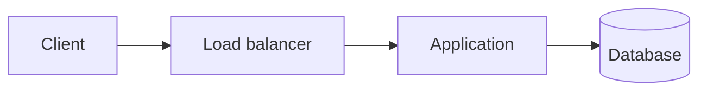

# Inkpath

Inkpath turns a directory of Markdown files into a small static notes or documentation site. It has one layout, one stylesheet, and no framework code in the generated pages.

Inkpath is a standalone package. A site keeps its own Markdown and adds Inkpath as a dependency; the generator does not own or copy that content back into this repository.

## Use it

```bash
pnpm install
pnpm dev
```

That command runs the sanitized site in `examples/basic/` at `http://127.0.0.1:3000` and reloads after a successful rebuild.

To use Inkpath from another pnpm project before an npm release:

```bash
pnpm add github:iamrajjoshi/inkpath#<commit-sha>
pnpm exec inkpath dev
```

Pin an exact commit so builds stay reproducible. While the GitHub repository is private, installs and deployment jobs also need GitHub credentials with read access.

The project using Inkpath supplies `content/`, `public/`, and an optional `inkpath.yaml`.

```bash
pnpm exec inkpath check       # parse and validate without writing
pnpm exec inkpath build       # write the static site to site/
pnpm exec inkpath dev         # build, serve, watch, and live reload
```

The generated `site/` directory can be served by any static file host.

## Content layout

Inkpath uses the filesystem as the navigation tree.

```text
content/
├── INDEX.md
├── 01-cloud-infrastructure/
│   ├── INDEX.md
│   ├── 01-cloud-foundations.md
│   └── 02-containers.md
└── 02-system-design/
    ├── INDEX.md
    └── 01-frame-the-problem.md
```

- The root `INDEX.md` is the home page.
- A directory `INDEX.md` is the section overview.
- Other Markdown files are notes.
- A numeric filename prefix supplies the default order and is omitted from the URL.
- Frontmatter `order` and `slug` override those defaults.
- Section and note lists, compact page details, previous/next links, and a contents list for notes with at least three headings are generated from those files.

Minimal frontmatter:

```yaml
---
title: Storage engines
description: How pages, logs, indexes, and compaction shape database behavior.
order: 3
---
```

Supported presentation metadata includes `number`, `date`, and `updated`. Other fields, including `duration`, `difficulty`, and `tags`, are validated or preserved for sites that want to use them later.

If `description` and `summary` are absent, Inkpath uses the first prose sentence as the page summary. This is deterministic; it does not call a model or a network service.

## Markdown

Inkpath supports headings, links, images, tables, blockquotes, lists, fenced code, syntax highlighting, footnotes, and block annotations.

```md
A write is not durable merely because the API returned.[^durability]

[^durability]: Define the exact persistence boundary promised by the system.
```

Short footnotes can stay inline in the source. Both forms render in the same numbered footnotes section.

```md
The retry budget belongs to the operation.^[One user action can span several network attempts.]
```

### Annotations

Use a block annotation when context should remain beside the main text. The syntax is compatible with GitHub Markdown.

```md
> [!NOTE]
> Replication improves availability, not correctness by itself.

> [!WARNING]
> Retrying a non-idempotent write can duplicate the operation.
```

`NOTE`, `TIP`, `IMPORTANT`, `WARNING`, and `CAUTION` are supported. They render as simple labeled asides without JavaScript; malformed or lowercase markers remain ordinary blockquotes.

Relative links to other notes use their source filenames. Inkpath rewrites them to the generated routes and fails the build when the target or fragment does not exist.

```md
[Read the storage note](../03-system-design/03-storage-data-modeling.md#write-ahead-logs)
```

Relative images and files are copied from `content/` and checked during the build. Raw HTML and MDX are intentionally not executed.

### Mermaid

Use a `mermaid` fence. Every diagram needs Mermaid's accessible title and description fields.

````md

````

Mermaid is bundled locally only when at least one page needs it. It runs with strict security settings. If rendering fails, the escaped diagram source remains readable.

## Configuration

`inkpath.yaml` is optional.

```yaml
content: content
output: site
public: public

site:
  title: My notes
  description: Notes about systems I want to remember.
  lang: en
  basePath: /notes
  url: https://example.com
  logo: favicon.svg

theme:
  accent: "#0f766e"
  interactive: "#0f766e"
  subtle: "#f0fdfa"
```

`basePath` prefixes every generated link and asset. The output, content, and public directories must remain inside the project root.

`site.logo` is an optional path inside `public`. When present, Inkpath places the image beside the site title and treats it as decorative because the title already names the home link. Without it, the default three-line mark remains. The path is validated during every build and respects `basePath`.

The optional theme values change the site mark and annotation border (`accent`), link underlines and focus rings (`interactive`), and inline-code or annotation background (`subtle`). Colors must use six-digit hexadecimal notation. The default palette remains unchanged when `theme` is omitted.

## Deliberate limits

Inkpath has no plugin API, template language, theme-selection system, search index, MDX runtime, deployment adapter, analytics, or database. It ships one content-first theme based on a narrow reading column, system fonts, and simple typographic navigation. A full rebuild is the correctness baseline. The development server binds to loopback unless another host is passed explicitly.

The build stages are kept separate: discover and parse content, derive routes, validate links and assets, render HTML, then atomically replace the previous output. A failed build leaves the last successful site in place.

## Development

```bash
pnpm typecheck
pnpm test
pnpm check
pnpm build
pnpm example:build
pnpm verify
```

The tests cover route ordering, summaries, annotations, footnotes, code escaping and highlighting, Mermaid accessibility and security, broken links and assets, base paths, deterministic output, and traversal-safe serving.
