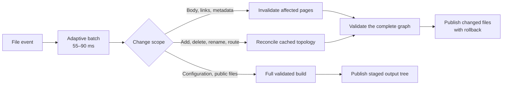
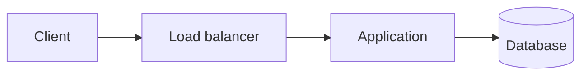

<p align="center">
  
</p>

<h1 align="center">Inkpath</h1>

<p align="center"><strong>Fast, strict static sites for Markdown notes and documentation.</strong></p>

<p align="center">
  <a href="https://github.com/iamrajjoshi/inkpath/actions/workflows/ci.yml"></a>
  <a href="LICENSE"></a>
  <a href="package.json"></a>
</p>

<p align="center">
  <a href="https://inkpath.dev/">Live demo</a> ·
  <a href="#quick-start">Quick start</a> ·
  <a href="#measured-performance">Benchmarks</a> ·
  <a href="https://github.com/iamrajjoshi/inkpath/issues">Issues</a>
</p>

Inkpath turns a Markdown directory into a static notes or documentation site. It rejects broken links, anchors, and local assets before publishing; a failed development rebuild leaves the previous valid site online.

- Rebuild cost follows the affected content instead of total site size.
- Ordinary pages contain plain HTML and CSS with no Inkpath JavaScript.
- Directories become nested navigation, with backlinks and adjacent-page links generated automatically.
- Output stays deterministic and can be deployed to any static host.

## Quick start

Inkpath requires Node.js 22.13 or newer.

```bash
npm install --save-dev inkpath
# or: pnpm add -D inkpath
```

Add the Inkpath commands to `package.json`:

```json
{
  "scripts": {
    "build": "inkpath build",
    "check": "inkpath check",
    "dev": "inkpath dev"
  }
}
```

Add a `content/INDEX.md` file:

```md
---
title: Engineering notes
description: Notes about systems and software.
---

Write the home page here.
```

Start the development server:

```bash
npm run dev
```

Open `http://127.0.0.1:3000`. Saving Markdown, configuration, or files under `public/` rebuilds the site and refreshes the page.

| Command         | Purpose                                           |
| --------------- | ------------------------------------------------- |
| `npm run dev`   | Serve the site and rebuild it after local changes |
| `npm run check` | Validate without writing output                   |
| `npm run build` | Write the static site to `site/`                  |

Pass a project path or options after `--`, such as `npm run dev -- ./notes --port 4000`. If you don't want to add scripts, the direct form remains available: `npx inkpath dev`.

Deploy the generated `site/` directory to GitHub Pages, Netlify, Cloudflare Pages, S3, or any other static host.

## Measured performance

These results come from the deterministic `core` fixture on an Apple M4 Pro with Node.js 26.5.0. Medians use isolated workers unless the row says otherwise. The report pins the exact artifact for each run; structural and watcher results are follow-up validations, while the clean, body-edit, 100,000-page, and byte rows come from the original publication suite.

| Measurement                                 | Result                       |
| ------------------------------------------- | ---------------------------- |
| 10,000-page clean build                     | 2,282.81 ms median           |
| 10,000-page body edit inside the engine     | 6.25 ms median               |
| 10,000-page add, delete, rename, route edit | 118.62–127.38 ms, one sample |
| 100,000-page body edit                      | 10.22 ms median              |
| Source edit through watcher completion      | 60.62 ms median, 61.98 p95   |
| Ordinary page plus shared CSS               | 4,026 B gzip, no JavaScript  |

### Pinned 1,000-page comparison

| Tool        | Fresh production build | Persistent body edit | Whole-site Brotli output | Standalone JavaScript |
| ----------- | ---------------------: | -------------------: | -----------------------: | --------------------: |
| **Inkpath** |                0.415 s |              98.2 ms |                 0.92 MiB |                   0 B |
| Hugo        |                0.329 s |             500.0 ms |                 0.32 MiB |                   0 B |
| Quartz      |                1.761 s |             319.8 ms |                 1.73 MiB |                 664 B |
| MkDocs      |                5.089 s |           5,053.8 ms |                 4.81 MiB |              91,523 B |
| Docusaurus  |               49.092 s |             333.8 ms |                 5.36 MiB |           4,425,152 B |

Lower is better. The table keeps the original all-tool run intact; a later Inkpath-only scheduler run measured 60.62 ms for the same development boundary. The tools did not render identical feature sets: Hugo used minimal templates without generated navigation or CSS, while MkDocs and Docusaurus emitted fuller navigation and application assets. Quartz ran with several optional browser features disabled.

Every writing benchmark hashes the complete output tree and rejects an incremental result that differs from a clean build after the same mutation. Read the [benchmark methodology](benchmarks/README.md), [Inkpath results](benchmarks/results/final.md), and [pinned cross-tool report](benchmarks/results/comparison.md) for commands, raw samples, memory, byte counts, and measurement limits.

## Why rebuilds are fast



Most of the speedup came from doing less work. A body edit reads and parses one source, updates its graph edges, renders the pages whose HTML can change, then writes only changed output. Additions, deletions, renames, and route changes rebuild topology from cached page objects instead of reparsing every Markdown file.

Clean builds overlap bounded file reads and writes, reuse Markdown and document-rendering setup across pages, build backlinks with sets, pre-plan destination directories, and reuse content-addressed Mermaid assets. None of these paths skips validation: Inkpath checks the resulting graph before publication and commits cached state only after output succeeds.

## Content

Inkpath uses directories as navigation:

```text
content/
├── INDEX.md
├── 01-infrastructure/
│   ├── INDEX.md
│   ├── 01-containers.md
│   └── 02-kubernetes/
│       ├── INDEX.md
│       └── 01-networking.md
└── 02-system-design/
    ├── INDEX.md
    └── 01-requirements.md
```

- The root `INDEX.md` becomes the home page.
- Each Markdown-bearing directory needs an `INDEX.md` overview. Asset-only directories don't.
- Sections can nest to any practical filesystem depth.
- Numeric filename prefixes set the default order and stay out of generated URLs.
- `order` and `slug` frontmatter override those defaults.
- The home page lists Collections. Section pages list Notes.

Each page accepts frontmatter:

```yaml
---
title: Storage engines
description: How logs, pages, indexes, and compaction shape a database.
order: 3
identifier: DB3
slug: storage-engines
---
```

`title`, `description`, `summary`, `order`, `identifier`, `slug`, `date`, `updated`, `duration`, `difficulty`, `tags`, and `draft` are supported. Unknown keys fail validation so misspellings do not silently disappear. A numeric filename or `order` controls navigation; `identifier` is display text only. The obsolete `number` key is not supported. Inkpath renders the identifier, dates, duration, difficulty, and tags on the page by default. `theme.showPageDetails` controls metadata below page headings, while `theme.showListDetails` controls identifiers, duration, and difficulty in collection and note listings. `showPageDetails` defaults to `true`; an omitted `showListDetails` inherits that value. Breadcrumbs remain visible when page details are hidden.

Relative links use source filenames. Inkpath rewrites them to generated routes and rejects missing pages, headings, images, or files.

## Markdown

Inkpath renders headings with permalink anchors, tables, nested lists, language-colored code blocks, footnotes, callouts, Mermaid diagrams, and optional KaTeX. Raw HTML and MDX aren't executed.

Footnotes can be named or inline:

```md
A successful response isn't proof of durable storage.[^durability]

[^durability]: Name the persistence boundary promised by the API.

Retries need an operation identity.^[One action can span several requests.]
```

Callouts use GitHub-style markers. Text after the marker sets a custom title. Add `-` for a collapsed callout or `+` for one that starts open:

```md
> [!NOTE] Replication boundary
> Replication improves availability, not correctness by itself.

> [!WARNING]- Retry detail
> Retrying a non-idempotent write can duplicate it.
```

Mermaid diagrams need an accessible title and description:

````md

````

Mermaid ships locally and runs with strict security settings. Inkpath writes a small hashed ESM entry and split, hashed chunks. The browser loads Mermaid only on diagram pages, then loads the implementation for the diagram type it encounters. A content-addressed cache reuses those exact files across Markdown rebuilds. If rendering fails, the escaped diagram source remains readable.

When a site contains Mermaid, Inkpath writes `_inkpath/THIRD_PARTY_NOTICES.txt` from the exact dependency installations that contributed code to that site's esbuild bundle. The notice and emitted bytes share the same cache identity, so a different resolved dependency graph cannot reuse a stale bundle or notice.

Enable build-time KaTeX in `inkpath.yaml`:

```yaml
markdown:
  math: true
```

Then use `$x + y$` for inline math or `$$` fences for display math. Inkpath writes the HTML during the build and copies KaTeX CSS, fonts, and the resolved KaTeX package's `LICENSE` text only when math is present. The license is written beside those assets as `_inkpath/katex/LICENSE.txt`.

## Links and discovery files

Inkpath derives backlinks from relative Markdown links and lists them on each destination page. Every build also writes `_inkpath/orphans.json`, which reports notes with no incoming Markdown links.

When `site.url` is set, Inkpath writes canonical URLs, Open Graph tags, and `sitemap.xml`. Dated pages are also included in `rss.xml` and `atom.xml`. Set `site.image` to a public image for `og:image`; `site.logo` is the fallback.

## Configuration

`inkpath.yaml` is optional:

```yaml
content: content
output: site
public: public

site:
  author: Raj Joshi
  title: My notes
  description: Notes about systems I want to remember.
  lang: en
  basePath: /notes
  url: https://example.com
  logo: favicon.svg
  image: social-card.svg

markdown:
  math: true

theme:
  accent: "#2dd4bf"
  interactive: "#0f766e"
  interactiveHover: "#0b5f59"
  showListDetails: false
  showPageDetails: false
  subtle: "#f0fdfa"
```

Set both values to control them independently. For example, `showPageDetails: true` with `showListDetails: false` keeps dates and tags beneath each page heading while hiding declared duration metadata in its collection list.

`interactive` and `interactiveHover` set readable link text for its resting and hover states. When only `interactive` is customized, its value is also used on hover. `accent` is reserved for selection, hover underlines, and small decorative marks, while `subtle` colors quiet surfaces such as callouts and inline code. Keep `accent` out of normal text unless its contrast is sufficient.

Unknown configuration keys fail validation. Paths must stay inside the project. `site.logo` and `site.image` point to regular files under `public/`. `site.url` is the public origin; use `basePath` for a site mounted below `/`. A base path must start with `/`, must already be normalized, and cannot contain a trailing slash, query, fragment, dot segment, or encoded path separator. `site.author` is used by the Atom feed.

To own the full stylesheet, put a CSS file under `public/` and set its path:

```yaml
theme:
  stylesheet: styles/notes.css
```

Inkpath links this file instead of generating `_inkpath/theme.css`. A custom stylesheet cannot be combined with theme color settings.

## Library API

The package exports the clean builder, persistent engine, configuration loader, content loader, and their TypeScript types:

```ts
import { buildSite, createBuildEngine } from "inkpath";

const result = await buildSite("./notes");
console.log(`Built ${result.pages} pages`);

const engine = createBuildEngine("./notes");
try {
  await engine.build();
  await engine.rebuild(["content/changed-note.md"]);
} finally {
  await engine.close();
}
```

Use `buildSite` for one-shot builds and checks. `createBuildEngine` retains parsed content and graph state for long-running integrations.

## Repository development

```bash
pnpm install
pnpm verify
pnpm package:check
```

`pnpm verify` runs type checking, tests, content validation, and the example build. `pnpm package:check` packs Inkpath, installs the archive in a temporary project, runs the CLI, builds a site, and imports the library API.

Report bugs or request features through [GitHub Issues](https://github.com/iamrajjoshi/inkpath/issues). Inkpath is available under the [MIT license](LICENSE).
