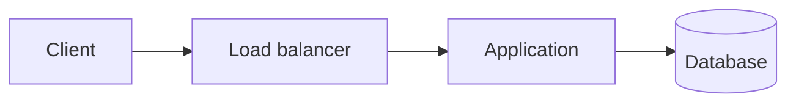

# Inkpath

Inkpath builds static notes and documentation sites from Markdown. It writes plain HTML and CSS and serves a live preview while you edit. Built pages use browser JavaScript only when they contain a Mermaid diagram.

> [!NOTE]
> [See a live Inkpath demo](https://inkpath.dev/).

## Install

Inkpath requires Node.js 22.13 or newer.

```bash
pnpm add -D inkpath
```

## Create a site

Add a `content/INDEX.md` file:

```md
---
title: Engineering notes
description: Notes about systems and software.
---

Write the home page here.
```

Start the development server:

```bash
pnpm exec inkpath dev
```

Open `http://127.0.0.1:3000`. Saving Markdown, configuration, or files under `public/` rebuilds the site and refreshes the page.

Other commands:

```bash
pnpm exec inkpath check   # validate without writing output
pnpm exec inkpath build   # write the static site to site/
pnpm exec inkpath --help
pnpm exec inkpath --version
```

## Content

Inkpath uses directories as navigation:

```text
content/
├── INDEX.md
├── 01-infrastructure/
│   ├── INDEX.md
│   ├── 01-containers.md
│   └── 02-kubernetes/
│       ├── INDEX.md
│       └── 01-networking.md
└── 02-system-design/
    ├── INDEX.md
    └── 01-requirements.md
```

- The root `INDEX.md` becomes the home page.
- Each Markdown-bearing directory needs an `INDEX.md` overview. Asset-only directories don't.
- Sections can nest to any practical filesystem depth.
- Numeric filename prefixes set the default order and stay out of generated URLs.
- `order` and `slug` frontmatter override those defaults.
- The home page lists Collections. Section pages list Notes.

Each page accepts frontmatter:

```yaml
---
title: Storage engines
description: How logs, pages, indexes, and compaction shape a database.
order: 3
identifier: DB3
slug: storage-engines
---
```

`title`, `description`, `summary`, `order`, `identifier`, `slug`, `date`, `updated`, `duration`, `difficulty`, `tags`, and `draft` are supported. Unknown keys fail validation so misspellings do not silently disappear. A numeric filename or `order` controls navigation; `identifier` is display text only. The obsolete `number` key is not supported. Inkpath renders the identifier, dates, duration, difficulty, and tags on the page by default. `theme.showPageDetails` controls metadata below page headings, while `theme.showListDetails` controls identifiers, duration, and difficulty in collection and note listings. `showPageDetails` defaults to `true`; an omitted `showListDetails` inherits that value. Breadcrumbs remain visible when page details are hidden.

Relative links use source filenames. Inkpath rewrites them to generated routes and rejects missing pages, headings, images, or files.

## Markdown

Inkpath renders headings with permalink anchors, tables, nested lists, language-colored code blocks, footnotes, callouts, Mermaid diagrams, and optional KaTeX. Raw HTML and MDX aren't executed.

Footnotes can be named or inline:

```md
A successful response isn't proof of durable storage.[^durability]

[^durability]: Name the persistence boundary promised by the API.

Retries need an operation identity.^[One action can span several requests.]
```

Callouts use GitHub-style markers. Text after the marker sets a custom title. Add `-` for a collapsed callout or `+` for one that starts open:

```md
> [!NOTE] Replication boundary
> Replication improves availability, not correctness by itself.

> [!WARNING]- Retry detail
> Retrying a non-idempotent write can duplicate it.
```

Mermaid diagrams need an accessible title and description:

````md

````

Mermaid ships locally and runs with strict security settings. Inkpath writes a small hashed ESM entry and split, hashed chunks. The browser loads Mermaid only on diagram pages, then loads the implementation for the diagram type it encounters. A content-addressed cache reuses those exact files across Markdown rebuilds. If rendering fails, the escaped diagram source remains readable.

When a site contains Mermaid, Inkpath writes `_inkpath/THIRD_PARTY_NOTICES.txt` from the exact dependency installations that contributed code to that site's esbuild bundle. The notice and emitted bytes share the same cache identity, so a different resolved dependency graph cannot reuse a stale bundle or notice.

Enable build-time KaTeX in `inkpath.yaml`:

```yaml
markdown:
  math: true
```

Then use `$x + y$` for inline math or `$$` fences for display math. Inkpath writes the HTML during the build and copies KaTeX CSS, fonts, and the resolved KaTeX package's `LICENSE` text only when math is present. The license is written beside those assets as `_inkpath/katex/LICENSE.txt`.

## Links and discovery files

Inkpath derives backlinks from relative Markdown links and lists them on each destination page. Every build also writes `_inkpath/orphans.json`, which reports notes with no incoming Markdown links.

When `site.url` is set, Inkpath writes canonical URLs, Open Graph tags, and `sitemap.xml`. Dated pages are also included in `rss.xml` and `atom.xml`. Set `site.image` to a public image for `og:image`; `site.logo` is the fallback.

## Configuration

`inkpath.yaml` is optional:

```yaml
content: content
output: site
public: public

site:
  author: Raj Joshi
  title: My notes
  description: Notes about systems I want to remember.
  lang: en
  basePath: /notes
  url: https://example.com
  logo: favicon.svg
  image: social-card.svg

markdown:
  math: true

theme:
  accent: "#2dd4bf"
  interactive: "#0f766e"
  interactiveHover: "#0b5f59"
  showListDetails: false
  showPageDetails: false
  subtle: "#f0fdfa"
```

Set both values to control them independently. For example, `showPageDetails: true` with `showListDetails: false` keeps dates and tags beneath each page heading while hiding declared duration metadata in its collection list.

`interactive` and `interactiveHover` set readable link text for its resting and hover states. When only `interactive` is customized, its value is also used on hover. `accent` is reserved for selection, hover underlines, and small decorative marks, while `subtle` colors quiet surfaces such as callouts and inline code. Keep `accent` out of normal text unless its contrast is sufficient.

Unknown configuration keys fail validation. Paths must stay inside the project. `site.logo` and `site.image` point to regular files under `public/`. `site.url` is the public origin; use `basePath` for a site mounted below `/`. A base path must start with `/`, must already be normalized, and cannot contain a trailing slash, query, fragment, dot segment, or encoded path separator. `site.author` is used by the Atom feed.

To own the full stylesheet, put a CSS file under `public/` and set its path:

```yaml
theme:
  stylesheet: styles/notes.css
```

Inkpath links this file instead of generating `_inkpath/theme.css`. A custom stylesheet cannot be combined with theme color settings.

## Development

```bash
pnpm install
pnpm verify
pnpm package:check
```

`pnpm verify` runs type checking, tests, content validation, and the example build. `pnpm package:check` packs Inkpath, installs the archive in a temporary project, runs the CLI, builds a site, and imports the library API.
