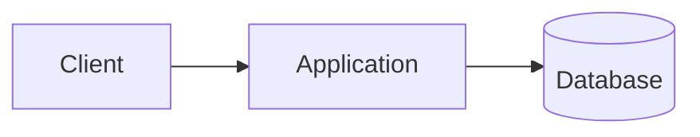

This first sentence becomes the automatic summary. A second sentence should not be required.

## Request path

Read the [second note](02-second.md#second-section) and the [local data](sample.txt).

The commit result survives a lost response.[^commit]

Inline context can stay near its claim.^[This is a short inline footnote.]

A repeated reference returns to the same explanation.[^commit]

[^commit]: The write-ahead log reached the configured durability boundary.

> [!NOTE]
> An annotation can contain **Markdown** and a [validated link](02-second.md#second-section).

> [!WARNING]
> Keep retry ownership at one layer.

> [!note]
> Lowercase markers remain ordinary blockquotes.

```ts
const unsafe = "<script>&";
```

<script>alert("raw HTML must not run")</script>


