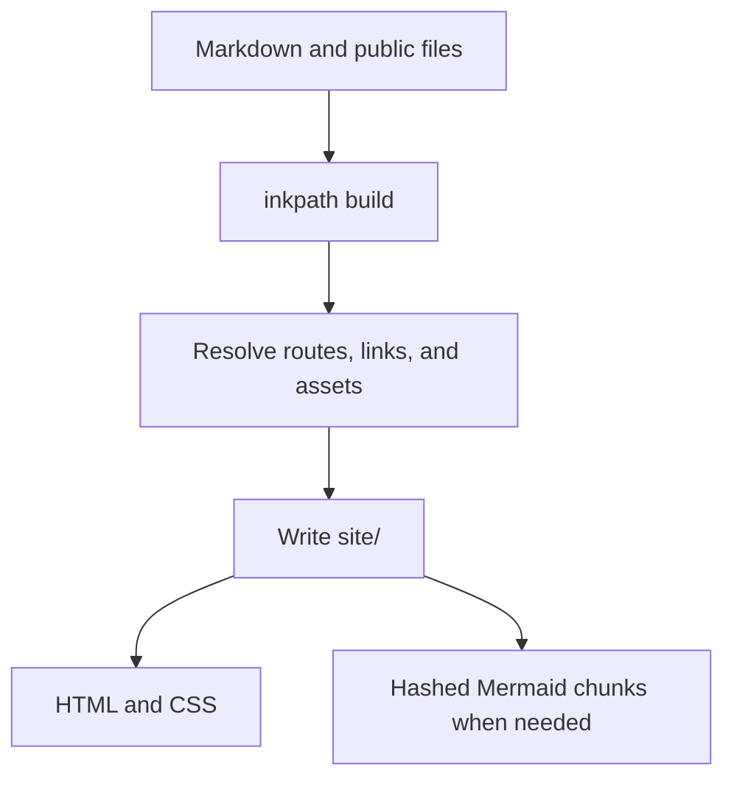

Inkpath turns a directory of Markdown files into a static website. It writes plain HTML and CSS. Pages without Mermaid diagrams contain no Inkpath JavaScript.

[Source code](https://github.com/iamrajjoshi/inkpath) · [npm package](https://www.npmjs.com/package/inkpath)

> [!NOTE] This site uses Inkpath
> This page was generated by Inkpath from [`website/content/INDEX.md`](https://github.com/iamrajjoshi/inkpath/blob/main/website/content/INDEX.md).

## Install

Inkpath requires Node.js 22.13 or newer.

```bash
pnpm add -D inkpath
```

## Start with one file

Create `content/INDEX.md`:

```md
---
title: Engineering notes
description: Notes about systems I want to remember.
---

Write the home page here.
```

Directories become sections, while Markdown files become pages. Numeric filename prefixes control their default order without appearing in the generated URLs.

## Preview while you write

```bash
pnpm exec inkpath dev
```

The development server watches Markdown, configuration, and public files. A successful edit rebuilds the site and refreshes the browser; a failed build leaves the last valid output in place.

## One source tree, one site graph

Inkpath reads the content tree, resolves page relationships, validates references, and then writes the static site. Public files pass through unchanged.



`inkpath check` walks the same content graph without writing the output directory, so it can catch a broken page or anchor in CI.[^validation]

The Mermaid entry file is small. The browser imports Mermaid only on a diagram page, then loads the chunk for the diagram type it encounters. Inkpath reuses versioned chunks between Markdown rebuilds.

## Markdown and its output

| Feature        | What Inkpath writes                                                                                 |
| -------------- | --------------------------------------------------------------------------------------------------- |
| Navigation     | Nested sections, breadcrumbs, contents, adjacent notes, and heading permalinks.                     |
| References     | Validated relative links, backlinks on destination pages, and `_inkpath/orphans.json`.              |
| Page metadata  | Identifiers, dates, duration, difficulty, and tags from frontmatter.                                |
| Discovery      | Canonical and Open Graph metadata, `sitemap.xml`, `rss.xml`, and `atom.xml` when `site.url` is set. |
| Rich Markdown  | Footnotes, tables, highlighted code, callouts, Mermaid, and optional build-time KaTeX.              |
| Browser assets | Content-hashed ESM chunks only on pages that contain Mermaid.                                       |

> [!TIP]
> Use frontmatter for page metadata and filenames for structure. `order` can override filename order, while `identifier` adds a label without changing navigation.

> [!IMPORTANT]- Why the orphan report is separate
> Navigation and content links answer different questions. A note can appear in a collection but still have no incoming Markdown link. Inkpath records that note in `_inkpath/orphans.json`.

## Math without a browser runtime

Set `markdown.math: true` in `inkpath.yaml`. Inkpath renders inline math such as $T_{edit} = T_{parse} + T_{render}$ and display math during the build:

$$
Sitemap = \{URL_1, URL_2, \ldots, URL_n\}
$$

KaTeX CSS and fonts are copied only when a page contains math.

## Markdown support

- Headings, tables, nested lists, fenced code blocks, and syntax highlighting
- Footnotes, custom or collapsible callouts, Mermaid diagrams, and optional KaTeX
- Arbitrarily nested sections with breadcrumbs and adjacent-page navigation
- Relative-link, heading, image, and local-file validation
- Backlinks, an orphan report, feeds, a sitemap, and social metadata

Raw HTML and MDX aren't executed.

## Build

```bash
pnpm exec inkpath check
pnpm exec inkpath build
```

The build writes a directory of static files that can be served by GitHub Pages, Cloudflare Pages, Netlify, an object store, or a regular web server.

[^validation]: Inkpath rejects missing Markdown targets, headings, images, and local files before replacing the previous successful output.
